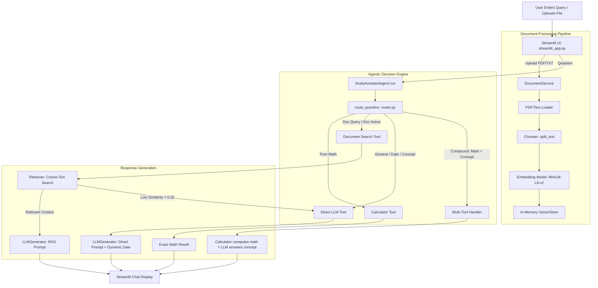

# AI Study Assistant

> An intelligent, agentic Study Assistant built with Retrieval-Augmented Generation (RAG), intent routing, and tool-augmented computing.

[](https://www.python.org/)
[](https://streamlit.io/)
[](https://groq.com/)
[](https://huggingface.co/sentence-transformers/all-MiniLM-L6-v2)

---

## 1. Project Overview

The **AI Study Assistant** is an agentic, multi-modal query resolution system designed for students, researchers, and professionals. Unlike standard chatbots that either hallucinate on specialized documents or fail at deterministic arithmetic, this assistant autonomously routes questions to specialized tools:

* **Document Grounding (RAG):** Answers specific questions based on uploaded documents (`.pdf`, `.txt`) using dense semantic vector search.
* **Direct Knowledge (LLM):** Answers general educational concepts, definitions, programming queries, and real-time date/time inquiries.
* **Deterministic Computation:** Executes mathematical expressions directly using a verified Python arithmetic engine, preventing LLM arithmetic hallucination.
* **Compound Multi-Tool Resolution:** Dynamically handles composite queries (e.g., *"What is RAG and calculate 4\*8"*) by pre-computing calculations and simultaneously synthesizing conceptual explanations.

---

## 2. Key Features

- **Autonomous Intent Routing:** Uses regex-based semantic guards and heuristic pattern classifiers to identify whether an inquiry belongs to document search, general knowledge, calculation, or a hybrid combination.
- **In-Memory Semantic Vector Store:** Employs `sentence-transformers/all-MiniLM-L6-v2` with cosine similarity ranking in pure NumPy for ultra-fast, lightweight vector retrieval.
- **Smart Fallback Mechanism:** When a user asks an out-of-scope question while a document is loaded, the assistant automatically detects low similarity (`< 0.20`) and seamlessly falls back to the Direct LLM instead of refusing to answer.
- **Deterministic Math Engine:** Safely extracts and computes arithmetic expressions (`+`, `-`, `*`, `/`, `%`, `percentages`), ensuring 100% precision.
- **Compound Query Handling (`MULTI_TOOL`):** Separates mathematical expressions from conceptual inquiries and delivers unified multi-part answers.
- **Client & Device Isolation:** Built on Streamlit's `st.session_state` and in-memory stores; documents uploaded by one user are strictly isolated to that specific browser session and are never accessible to other devices or users.

---

## 3. Architecture & Data Flow



---

## 4. Technology Stack

* **Language:** Python 3.10+
* **User Interface:** Streamlit
* **LLM Provider:** Groq Cloud API (`openai/gpt-oss-120b` or LLaMA models)
* **Embedding Model:** Hugging Face `sentence-transformers/all-MiniLM-L6-v2` (384 dimensions)
* **Vector Computation:** NumPy (Cosine similarity matrix calculations)
* **Document Loaders:** PyPDF loader for `.pdf`, UTF-8 stream loader for `.txt`
* **Configuration:** `python-dotenv`, Streamlit Cloud Secrets (`st.secrets`)

---

## 5. Project Directory Structure

```text
ai-study-assistant/
├── .devcontainer/                  # Dev container configuration for Codespaces
│   └── devcontainer.json
├── .env.example                    # Template for environment variables
├── .gitignore                      # Git exclusion rules
├── README.md                       # Comprehensive project documentation
├── requirements.txt                # Production and development dependencies
├── data/                           # Local sample documents & benchmarks
├── logs/                           # Runtime structured logs (app.log)
├── app/
│   ├── __init__.py
│   ├── config.py                   # Centralized configuration & environment loader
│   ├── exceptions.py               # Custom hierarchy of application exceptions
│   ├── logging_config.py           # Logging setup with console and file handlers
│   ├── agent/                      # Core agentic decision & execution layer
│   │   ├── __init__.py
│   │   ├── agent.py                # StudyAssistantAgent & response orchestration
│   │   └── router.py               # route_question & compound intent classifier
│   ├── loaders/                    # Text and PDF ingestion extractors
│   │   ├── __init__.py
│   │   ├── pdf_loader.py           # PDF parsing with error handling
│   │   └── text_loader.py          # Plaintext loading and normalization
│   ├── rag/                        # Retrieval-Augmented Generation pipeline
│   │   ├── __init__.py
│   │   ├── chunker.py              # Recursive sliding-window chunk splitter
│   │   ├── embeddings.py           # Sentence-transformers embedding wrapper
│   │   ├── generator.py            # Groq API client with dynamic system prompt
│   │   ├── prompts.py              # Prompt templates (RAG, Direct, System date)
│   │   ├── retriever.py            # Context retriever with filler word stripping
│   │   └── vector_store.py         # In-memory NumPy cosine similarity store
│   ├── services/
│   │   ├── __init__.py
│   │   └── document_service.py     # End-to-end document processing coordinator
│   ├── tools/
│   │   ├── __init__.py
│   │   ├── calculator.py           # Safe arithmetic calculation engine
│   │   └── document_search.py      # Search wrapper tool for the agent
│   └── ui/
│       ├── __init__.py
│       └── streamlit_app.py        # Streamlit web UI & session manager
└── tests/                          # Automated unit and integration test suite
    ├── test_agent.py
    ├── test_calculator.py
    ├── test_chunker.py
    ├── test_document_loader.py
    └── test_retriever.py
```

---

## 6. Installation & Setup

### Prerequisites
- Python 3.10 or higher
- A free API key from [Groq Console](https://console.groq.com/)

### Step 1: Clone the Repository
```bash
git clone https://github.com/Sourabh262/Ai_study_assistants.git
cd Ai_study_assistants
```

### Step 2: Create and Activate Virtual Environment
```bash
# Windows
python -m venv venv
.\venv\Scripts\activate

# Linux / macOS
python3 -m venv venv
source venv/bin/activate
```

### Step 3: Install Dependencies
```bash
pip install -r requirements.txt
```

### Step 4: Configure Environment Variables
Copy `.env.example` to `.env` and fill in your credentials:
```bash
cp .env.example .env
```

Edit `.env`:
```env
GROQ_API_KEY=gsk_your_actual_groq_api_key_here
GROQ_MODEL=openai/gpt-oss-120b
EMBEDDING_MODEL=sentence-transformers/all-MiniLM-L6-v2
CHUNK_SIZE=700
CHUNK_OVERLAP=120
TOP_K=5
MIN_SIMILARITY=0.05
```

---

## 7. Running the Application

### Local Development Server
Launch the interactive Streamlit interface:
```bash
streamlit run app/ui/streamlit_app.py
```
Open your browser at `http://localhost:8501`.

### Production Deployment (Streamlit Community Cloud)
1. Fork or push this repository to your GitHub account.
2. Visit [share.streamlit.io](https://share.streamlit.io) and link your repository.
3. Set **Main file path** to `app/ui/streamlit_app.py`.
4. Under **Advanced settings -> Secrets**, add:
   ```toml
   GROQ_API_KEY = "gsk_your_groq_api_key_here"
   ```
5. Deploy. Streamlit will provide a live, shareable HTTPS link.

---

## 8. Running Automated Tests

Run the unit test suite using Python's built-in test runner:
```bash
python -m unittest discover -s tests -p "test_*.py"
```

To run individual module test suites:
```bash
python -m unittest tests/test_calculator.py
python -m unittest tests/test_chunker.py
python -m unittest tests/test_document_loader.py
python -m unittest tests/test_retriever.py
```

---

## 9. Capstone Demonstration Guide

Follow this step-by-step test sequence to demonstrate all agent capabilities:

| Test Case | User Input | Expected Tool Selected | Expected Behavior / Output |
| :--- | :--- | :--- | :--- |
| **1. Document Upload** | Upload resume or notes (`.pdf` or `.txt`) and click *Process* | N/A | Document status turns green (`Document ready`), displays chunk count. |
| **2. Document Query** | *"What are my skills according to the document?"* | `document_search` | Answers with exact skills found in document + citations with similarity scores. |
| **3. General Knowledge (Out-of-doc)** | *"What is python?"* | `direct_llm` | Recognizes question is outside document scope, provides full educational definition. |
| **4. Pure Calculation** | *"calculate 45 \* 12"* | `calculator` | Evaluates arithmetic instantly: `The answer is 540.` |
| **5. Compound Inquiry** | *"WHAT IS RAG AND 4\*8"* | `multi_tool` | Computes `4*8 = 32` via calculator and explains RAG architecture in full detail. |
| **6. Real-Time Date Query** | *"what is today's date"* | `direct_llm` | Formats and outputs the exact current date dynamically. |

---

## 10. How the Components Work

### 1. `StudyAssistantAgent` ([`app/agent/agent.py`](app/agent/agent.py))
The central brain of the system. It receives questions, calls `route_question` to determine intent, executes the selected tool (`_run_calculator`, `_run_document_search`, `_run_direct_llm`, or `_run_multi_tool`), and packages the result into an `AgentResponse` dataclass.

### 2. `Intent Router` ([`app/agent/router.py`](app/agent/router.py))
Evaluates the incoming query string against regex patterns and heuristics:
- `MATH_PATTERN` identifies arithmetic expressions.
- `is_compound_math_question` checks if a math inquiry contains conceptual text.
- `DOCUMENT_KEYWORDS` identifies file-grounded requests.
- `GENERAL_QUERY_PATTERN` isolates system date and identity inquiries.

### 3. `DocumentService` ([`app/services/document_service.py`](app/services/document_service.py))
Encapsulates document ingestion: file validation $\rightarrow$ raw text parsing $\rightarrow$ text chunking with overlap $\rightarrow$ dense embedding generation $\rightarrow$ vector store initialization.

### 4. `VectorStore` & `Retriever` ([`app/rag/vector_store.py`](app/rag/vector_store.py), [`app/rag/retriever.py`](app/rag/retriever.py))
- Computes cosine similarity: $\text{sim}(u, v) = \frac{u \cdot v}{\|u\| \|v\|}$.
- Ranks chunks and provides top-$k$ context snippets with similarity scores to the prompt builder.

### 5. `Calculator Engine` ([`app/tools/calculator.py`](app/tools/calculator.py))
Extracts mathematical expressions using regex and safely calculates results using Python's operator evaluation, avoiding unvalidated `eval()` risks.

---

## 11. Limitations & Future Work

### Current Limitations
* **In-Memory Volatility:** Vectors reside in session memory; uploading very large books (>500 pages) can consume substantial server RAM.
* **Document Types:** Currently limited to `.pdf` and `.txt` formats.
* **Single Active Document:** Searches across one active document per session at a time.

### Future Roadmap
* **Persistent Vector Databases:** Transition to ChromaDB, Qdrant, or Pinecone for persistent multi-user indexes.
* **Multi-Document Cross-Referencing:** Allow users to upload multiple textbooks simultaneously and compare topics across sources.
* **OCR Support:** Integrate Tesseract / AWS Textract for scanned images and handwritten notes.
* **Agentic Graph Execution (LangGraph):** Implement cyclical multi-agent review with automated self-correction of generated code and summaries.
